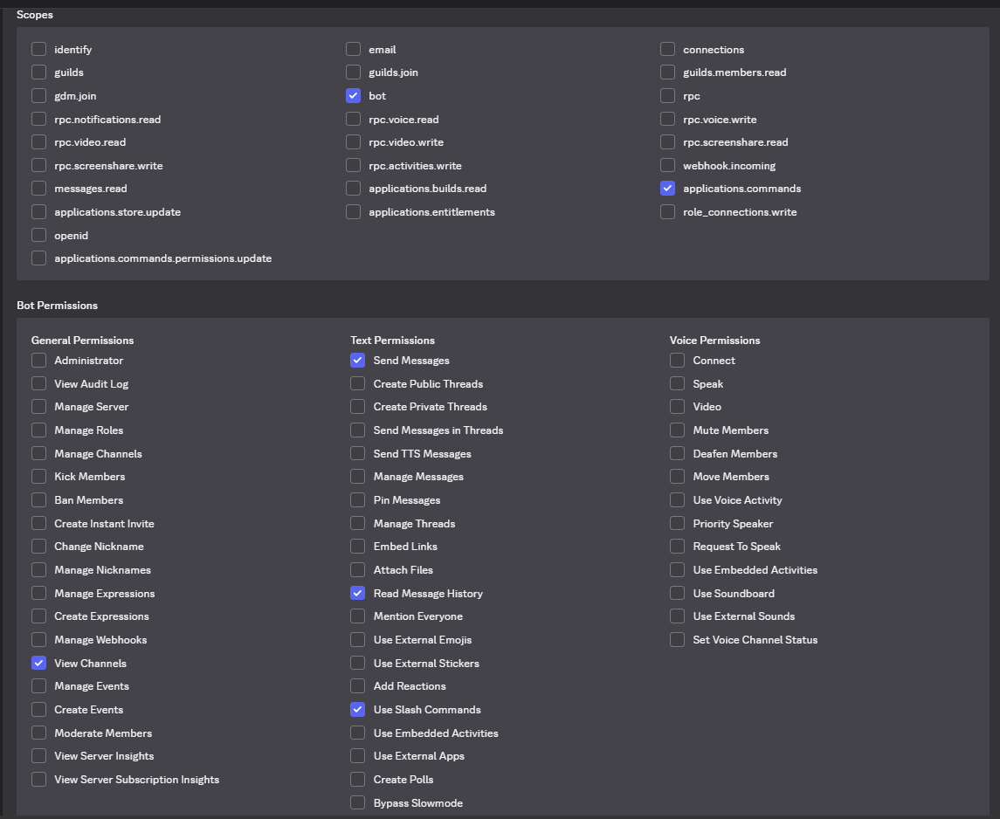

# Discord Detective AI 

An AI-powered Discord investigation bot that uses Retrieval-Augmented Generation (RAG) to answer questions about Discord conversations.

- Stores Discord messages in SQLite
- Generates embeddings using Sentence Transformers
- Stores vectors in ChromaDB
- Semantic search over chat history
- Local LLM using Ollama
- Slash command `/ask`
- Historical message indexing

## TO RUN THE BOT USE INSTRUCTIONS ON DEVELOPER PORTAL TO CREATE A BOT AND ENABLE THE FOLLOWING PERMISSIONS AND CREATE A .env file and paste DISCORD_TOKEN="YOUR_TOKEN"

## Tech Stack

- Python
- discord.py
- ChromaDB
- SQLite
- SentenceTransformers
- Ollama (Llama 3.2)

## Example

User:

/ask Who stole my diamonds?

Bot:

xyz most likely stole the diamonds.

Evidence:
- "Someone stole my diamonds."
- "xyz returned my diamonds."

## Future Improvements
- adding basic question answering even if unrelated to the chat
- adding message intent analyzer for better understanding
- Hybrid Search
- Context Windows
- Reranking
- Agentic Investigation